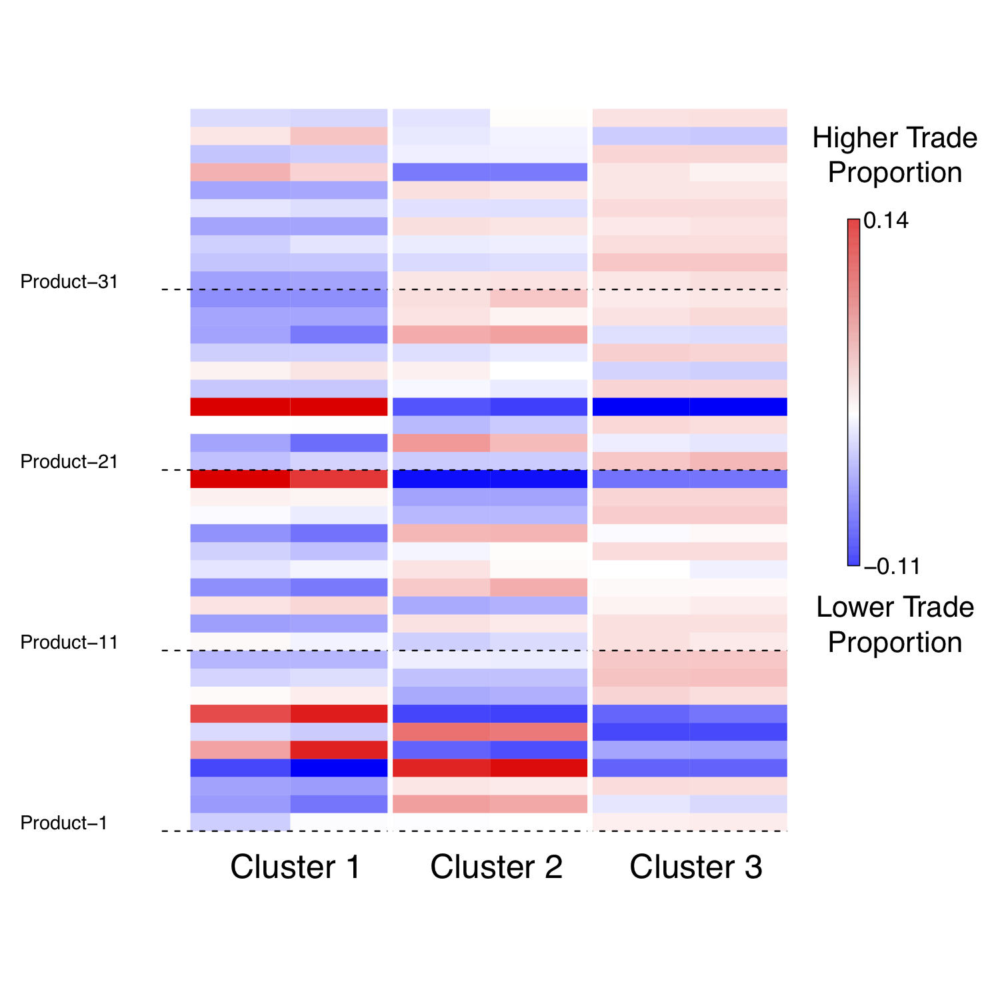
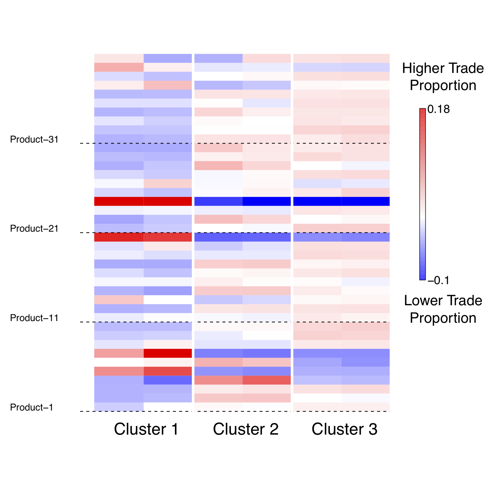

# dynCluster: Dynamic Clustering Algorithm 

[](https://travis-ci.org/kosukeimai/dynCluster)

## Overview
dynCluster implements a new dynamic clustering method that can effectively summarize massive amounts of granular dyadic flow data. For more details of the method and applications, see:

+ [Measuring Trade Profile with Granular Product-level Trade Data](https://www.stevenliao.org/uploads/2/5/6/9/25699716/bigtrade.pdf)

+ Authors: [In Song Kim](http://web.mit.edu/insong/www/index.html), [Steven Liao](https://www.stevenliao.org/), [Kosuke Imai](http://imai.princeton.edu/)

## Installation
We recommend installing dynCluster on [Amazon Web Services (AWS)](https://aws.amazon.com/). This approach will allow users to easily scale up to accommodate bigger datasets. For step-by-step instructions on how to install dynCluster on AWS, see our [Wiki page](https://github.com/kosukeimai/dynCluster/wiki/How-to-install-dynCluster-on-AWS)

## Usage: A Toy Example on AWS
1. Once dynCluster is installed on AWS, we create a small simulated dataset following the data generating process described in our [paper](https://www.stevenliao.org/uploads/2/5/6/9/25699716/bigtrade.pdf). For details, see our [Wiki page](https://github.com/kosukeimai/dynCluster/wiki/How-to-run-dynCluster-on-AWS).

    + The data covers `10` countries (`90` directed-dyads) trading `40` products over `10` time periods.
    ```
    ##   year cty1 cty2 product_1 product_2 product_3  product_4 product_5 ...
    ## 1    1    1    2         0         0         0        0.0         0     
    ## 2    1    1    3         0         0         0   664344.6         0  
    ## 3    1    1    4         0         0         0        0.0         0  
    ## 4    1    1    5    372390         0         0        0.0         0  
    ## 5    1    1    6   3171746   2797487   4872051   981809.8   2497946 
    ## ...
    ```

    + For each time period, dyads belong to `3` different clusters (e.g., types of international trade). Together, the data represent the "true" dyadic cluster memberships.
    ```
    ##   cty1 cty2 dyad z1 z2 z3 z4 z5 z6 z7 z8 z9 z10
    ## 1    1   10 1_10  2  2  2  2  2  2  2  2  2   2
    ## 2   10    1 1_10  2  2  2  2  2  2  2  2  2   2
    ## 3    1    2  1_2  1  1  1  1  1  1  1  1  1   1
    ## 4    2    1  1_2  1  1  1  1  1  1  1  1  1   1
    ## 5    1    3  1_3  2  2  2  2  2  2  2  2  2   2
    ## 6    3    1  1_3  2  2  2  2  2  2  2  2  2   2
    ## 7    1    4  1_4  2  2  2  2  2  1  1  1  1   1
    ## 8    4    1  1_4  2  2  2  2  2  1  1  1  1   1
    ## 9    1    5  1_5  2  2  2  2  2  2  2  2  2   2
    ## 10   5    1  1_5  2  2  2  2  2  2  2  2  2   2
    ## ...
    ```

    + The ultimate goal in this example is to see how well dynCluster can recover the three true clusters and the dyadic cluster memberships.

2. We then implement dynCluster in R using the function `mainZTM`. This function wraps and calls C++ functions (e.g., `mainRcpp`) from dynCluster.
    ```R
    # load library
    library(dynCluster)
        
    # run and time dynCluster
    ptm <- proc.time() # start the clock
    mainZTM("./sim-1", comeBack=TRUE)
    proc.time() - ptm # stop the clock
    ```
  + Note that this toy example runs on **t2.micro** instances in AWS, which is available as a [free tier](https://aws.amazon.com/free/).

3. To assess the performance of dynCluster, we create product-trade heatmaps based on the "true" cluster membership data above and the estimated output from dynCluster. For details, see our [Wiki page](https://github.com/kosukeimai/dynCluster/wiki/How-to-run-dynCluster-on-AWS).

    + A side-by-side comparison of the two heatmaps below show that the composition of product trade is very similar. This suggests that dynCluster did well in recovering the original clusters.

        True Product Proportion                    |  Estimated Product Proportion
        :-----------------------------------------:|:----------------------------:
          |  

    + The table below cross-tabulates the true vs. estimated cluster membership for each dyad-period. The cells in the diagonal show the number of dyad-periods correctly classified. Overall, dynCluster correctly recovered **98.4%** of the true dyadic cluster memberships.

        |          |           |             | **Estimated**     |             |       |
        |----------|-----------|------------:|------------------:|------------:|------:|
        |          |           | Cluster 1   | Cluster 2         | Cluster 3   | Total |
        |          | Cluster 1 | 167         | 0                 | 0           | 167   |
        | **True** | Cluster 2 | 1           | 187               | 6           | 194   |
        |          | Cluster 3 | 0           | 0                 | 89          | 89    |
        |          | Total     | 168         | 187               | 95          | 450   |
    
